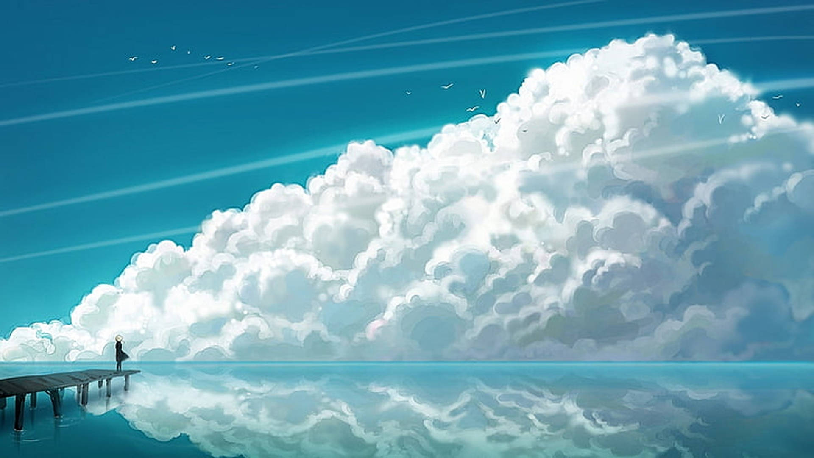

# 🌦️ Smart Weather Insight – API Powered Weather Forecast System

## Author

**Jinay Atul Golecha**
B.Tech Computer Engineering
Vishwakarma University, Pune

---

## Project Overview

Smart Weather Insight is a Python-based desktop application that provides real-time weather information and a 24-hour forecast using external weather APIs.

The application features a user-friendly graphical interface built with Tkinter and allows users to search weather conditions for any city worldwide.

Current weather information and hourly forecasts are fetched dynamically from OpenWeatherMap and VisualCrossing APIs.

---

## Features

✅ Real-Time Weather Forecast

✅ 24-Hour Hourly Forecast

✅ City-Based Weather Search

✅ Temperature Monitoring

✅ Weather Condition Tracking

✅ Wind Speed Information

✅ Sunrise & Sunset Timing

✅ Local Timezone Conversion

✅ Error Handling for Invalid Locations

✅ Modern Tkinter GUI

---

## Technologies Used

* Python
* Tkinter
* Requests
* Pillow (PIL)
* OpenWeatherMap API
* VisualCrossing API
* JSON
* Datetime
* Pytz

---

## System Architecture

User Input City Name

↓

OpenWeatherMap API

↓

Current Weather Data

↓

VisualCrossing API

↓

24-Hour Forecast Data

↓

Tkinter GUI Display

---

## Project Structure

WeatherInsight/

├── main.py

├── image.jpg

├── api_documentation.txt

├── project_report.pdf

├── requirements.txt

├── README.md

├── .gitignore

└── Screenshots/

---

## Screenshots

### Application Interface



### Forecast Example

Store additional screenshots inside:

Screenshots/

and reference them here.

---

## Installation

Clone Repository

```bash
git clone https://github.com/jinaygolecha/smart-weather-insight-api-python.git
```

Move into Project Directory

```bash
cd smart-weather-insight-api-python
```

Install Dependencies

```bash
pip install -r requirements.txt
```

Run Application

```bash
python main.py
```

---

## APIs Used

### OpenWeatherMap

Provides:

* Temperature
* Weather Conditions
* Wind Speed
* Sunrise Time
* Sunset Time
* Timezone Information

### VisualCrossing

Provides:

* Hourly Forecast
* Temperature Trends
* Future Weather Conditions

---

## Learning Outcomes

* API Integration
* Python GUI Development
* Weather Data Processing
* JSON Handling
* Timezone Conversion
* Error Handling
* Software Project Structuring

---

## Future Enhancements

* Weather Icons
* 7-Day Forecast
* Dark Mode
* Multiple Language Support
* Interactive Charts
* Weather History Analytics

---

## License

This project is developed for educational and learning purposes.

---

## Project Report

Detailed project documentation is included in:

project_report.pdf

---

## Contact

GitHub: https://github.com/jinaygolecha

LinkedIn: https://www.linkedin.com/in/jinay-golecha/
